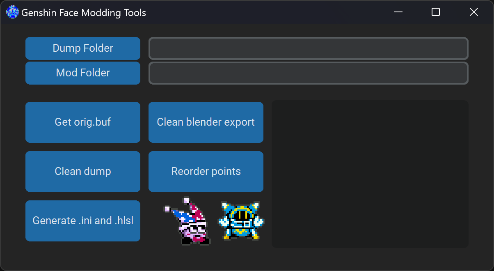

# Anime Game Face Modding Tools
Simple GUI to automate the current steps for face modding in GI  
  
[Full face modding tutorial by RainEndings](https://gamebanana.com/tuts/18672)
[Dumping tutorial](dumptutorial.md)  
[Quick video of creating a face mod, start to finish](https://www.youtube.com/watch?v=5CCtvyKprGU)  
## Usage
Bolded means you just press the button in the tool.
1. Obtain face dump
2. Open G. Face Modding Tools and **select dump and mod folder**
3. (**Get orig.buf**) Not always needed
4. **Clean face dump**
5. **Generate .ini and .hlsl**
6. Import to blender via `Import > 3DMigoto frame analysis dump (vb.txt + ib.txt)`
7. Export `Export > 3DMigoto raw buffers (.vb + .ib)` 
immediately without touching it, name the file `base`
9. Sculpt the part
10. Export `Export > 3DMigoto raw buffers (.vb + .ib)` 
 your finished work, name the file `key`
11. **Clean blender export**
12. (**Reorder points**) Not always needed

Done!
## Running the tool
Head over to [releases](https://github.com/gdsfdg/facemodtools/releases) and download the first zip. Unzip the whole folder somewhere and double-click the exe.  
Alternatively, download the source code and run facemodtools.py. You'll have to install customtkinter and pillow via `pip install customtkinter`.
## Features
### Folder selection
After selecting these two folders, the tool will use them for all of its functions.
#### Dump Folder
The folder of your dump. It should contain hash.json and .txt files.  
Please use a dump that only contains face files.  
The recommended dump contains every face part you want to edit (if you want to edit all of them, it would be eyebrows, face, and mouth, named) and the diffuse texture.
#### Mod Folder
The output folder. I recommend creating a new, empty folder in your GIMI mods folder, like `GIMI\Mods\childeface` or `GIMI\Mods\ChildeMod\face`.
### Get orig.buf
Input the file path to your frameanalysis folder (the same one you used for your dump) and hit Ok. The tool will search for the original buffers and copy them to your mod folder.  
It will take the first buffer it finds, which should be the first draw.  
A successful run should look like this:
```
Draw: 000029
Found brows/orig.buf
Draw: 000028
Found mouth/orig.buf
Draw: 000027
Found eyes/orig.buf
```
### Clean dump
Will clean your dump so it's ready for face modding.  
It deletes every attribute after the third attribute (so, COLOR and TEXCOORD) from the .txt files.  
Use this before importing to blender.
```
Copied original files to "uncleaned" folder.
Deleted COLOR and TEXCOORD attributes from every vb0 file in dump folder!
```

### Generate .ini and .hlsl
Will create a mod folder structure. It copies the basic .hlsl that every face mod uses and generates an ini with your hash and dispatch.  
If your dump contains a diffuse texture, it will use that to ensure your mod doesn't appear on other characters.  
If you have multiple parts, it will create one subfolder for each part.  
Use this before exporting from blender.
```
Generated mod folder files!
Please save your "base.buf" and "key.buf" into the generated subfolders.
```

### Clean blender export
Will rename your files and remove unnecessary files.  
We only really want base.buf and key.buf here, so it deletes generated .fmt and .ib files and renames the .vb0 to buf. It also ensures the files are named correctly.  
Use this after exporting from blender.
```
Renamed 6 .vb0 file(s) to .buf.
Deleted 12 .fmt and .ib files.
```
### Reorder points
Will fix crumpled up faces for some characters. It uses the original buffer to reorder the points from your blender exports, ensuring your exports are in the same order as vanilla.  
Use this if you encounter issues after finishing your mod and viewing it in game (or just press it, it's one click).  
Script by dixiao.
```
Fixed files in \brows
Fixed files in \eyes
Fixed files in \mouth
```
