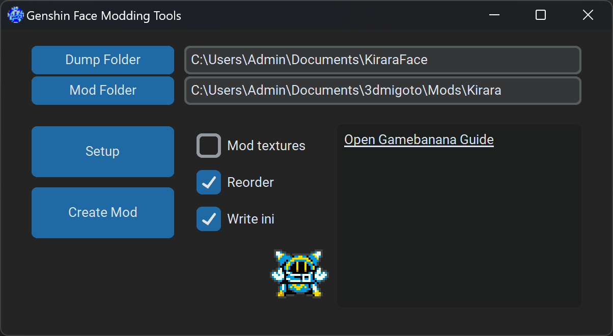

# Genshin Face Modding Tools
Simple GUI to automate the current steps for face modding in Genshin Impact  

[Full face modding tutorial by RainEndings](https://gamebanana.com/tuts/18672)  
[Dumping tutorial](dumptutorial.md)

[Quick video of creating a face mod, start to finish, outdated but still useful](https://www.youtube.com/watch?v=5CCtvyKprGU)  
## Running the tool
Head over to [releases](https://github.com/gdsfdg/facemodtools/releases) and download the first zip. Unzip the whole folder somewhere and double-click the exe.  
Alternatively, download the source code and run facemodtools.py. You'll have to install customtkinter and pillow via `pip install customtkinter`.
## Usage
1. Obtain face dump (Keep FrameAnalysis folder - If getting it from someone else, they need to have used "Setup" on it)
2. Open Genshin Face Modding Tools and press **Setup** (Once per dump)
3. (Optional) Delete FrameAnalysis folder
4. Import to blender via `Import > 3DMigoto frame analysis dump (vb.txt + ib.txt)`
5. Export `Export > 3DMigoto raw buffers (.vb + .ib)` immediately without touching it, name the file `base` (or create a shapekey)
6. Sculpt/Edit the part, don't change vert count or scale to 0
7. Export `Export > 3DMigoto raw buffers (.vb + .ib)` your finished work, name the file `key`
8. Press **Create mod** in the tool

Done!
## Features
### Folder selection
After selecting these two folders, the tool will use them for all of its functions. They will persist even if you close the tool.
#### Dump Folder
The folder of your dump. It should contain hash.json and .txt files.  
Please use a dump that only contains face files.  
The recommended dump contains every face part you want to edit (if you want to edit all of them, it would be eyebrows, face, and mouth, named) and the diffuse texture.
#### Mod Folder
The output folder. I recommend creating a new, empty folder in your GIMI mods folder, like `GIMI\Mods\childeface` or `GIMI\Mods\ChildeMod\face`.
### Setup
Use this before blender, once.
Input the file path to your frameanalysis folder (the same one you used for your dump; it auto-fills after your first use) and hit Ok. It will grab the original buffers which is necessary (since we are not overwriting vanilla, we need to match its format exactly) and stores them in your dump folder. It will take the first buffer it finds, which should be the first draw.  
A successful run should look like this:
```
Draw: 000029
Found brows/orig.buf
Draw: 000028
Found mouth/orig.buf
Draw: 000027
Found eyes/orig.buf
```
Then creates the structure of your mod folder to export into.
### Create mod
Use this after blender, every time you exported something.
It has three options:
- **Mod textures:** Applies the textures you dumped to the mod. Obviously useful if you want to mod them, off by default.
- **Reorder:** You can just always leave this on. Sometimes, your export needs to be reordered to match vanilla, and this does it.
- **Write ini:** Writes the ini and hlsl files and overwrites whatever you have. Disable if you made edits and don't want them to be overwritten.

"Create mod" strips unnecessary data (everything except positions) from your exports so they are uniform and small, and changes them into the correct file format. It also does the things mentioned above, if you enabled the checkboxes. The shader needs to know the stride of the model, which the tool finds for you as well (40 by default).

On repeated exports, it stores your base.buf in your dump folder so you only need to reexport key.buf. If anything is weird, try deleting that for a blank slate...

Thanx RainEndings for basically being the co-creator of da tool :3